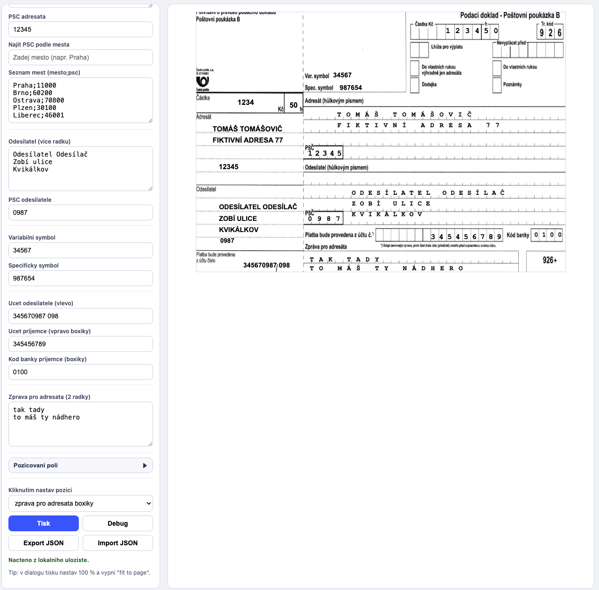

# Poštovní poukázka B - pozicování v prohlížeči

Jednoduchý nástroj pro ladění tisku údajů na českou poštovní poukázku typu B.
Vše běží čistě v HTML/JS v prohlížeči, bez instalace.

## K čemu to je

Soubor `postovni_poukazka_b.html` umožňuje přesně nastavovat pozice textů a čísel přímo nad podkladem poukázky:

- částka (vlevo i vpravo do boxů)
- adresát (vlevo i vpravo, včetně PSČ)
- odesílatel (vlevo i vpravo, včetně PSČ)
- symboly (variabilní, specifický)
- účty (účet odesílatele, účet příjemce, kód banky)
- zpráva pro adresáta (2 řádky v boxících)

## Výhody

- žádná instalace, jen otevřít HTML v browseru
- klikací nastavování pozice myší
- nastavení fontu, roztečí a řádkování tam, kde je potřeba
- automatické ukládání nastavení v prohlížeči
- export/import nastavení do JSON
- debug režim pro vizuální kontrolu polí

## Jak to používat

1. Otevřete `postovni_poukazka_b.html` v libovolném moderním prohlížeči.
2. Vyplňte hodnoty (částka, adresát, odesílatel, symboly, účty, zpráva).
3. V panelu **Pozicování polí** vyberte sekci, kterou chcete ladit.
4. V poli **Kliknutím nastav pozici** zvolte konkrétní položku.
5. Klikněte na náhledu poukázky na místo, kam chcete položku umístit.
6. Doladíte čísla ručně (X/Y, font, rozteč, řádkování) podle potřeby.
7. Před tiskem použijte tlačítko **Tisk**.

Tip: V dialogu tisku nastavte 100 % měřítko a vypněte "fit to page".

## Ukázka rozhraní (screenshot)

Pro zobrazení náhledu přímo v README uložte screenshot aplikace jako:

- `docs/screenshot.png`

Pak se zobrazí zde:



## Podkladový obrázek poukázky

Aplikace načítá podklad ze souboru:

- `poukazka-b.png`

Každý si může naskenovat vlastní formulář a použít svůj obrázek.
Stačí ho uložit do rootu projektu pod stejným názvem `poukazka-b.png`.

## Ukládání a přenos nastavení

- Nastavení se průběžně ukládá v prohlížeči (lokální úložiště).
- Přes tlačítka **Export JSON** a **Import JSON** lze nastavení přenášet mezi zařízeními/prohlížeči.

## Nejčastější problémy při tisku

- Tisk je posunutý: zkontrolujte měřítko na 100 %.
- Formular nesedí na stránce: vypněte volbu typu "fit to page" / "přizpůsobit stránce".
- Výška výtisku nesedí: do pole **Naměřená výška tisku mm** zadejte skutečnou vytištěnou výšku. Pokud výtisk měří 150 mm a má mít 101 mm, zadejte `150`; aplikace při tisku zmenší jen svislou osu.
- Jiný výsledek mezi prohlížeči: dolaďte pozice v prohlížeči, ze kterého budete skutečně tisknout.
- Rozpadlé znaky v boxících: upravte font/rozteč v příslušné pozicovací sekci.
- Nastavení zmizelo: ověřte, že je v prohlížeči povolené lokální úložiště, případně používejte Export JSON jako zálohu.

## Validace tiskového layoutu do PDF

Pro kontrolu, že se text při tisku na prázdný formulář neposune oproti tisku s podkladem, spusťte:

```bash
./scripts/validate-print-layout.sh
```

Skript vygeneruje PDF přes headless Chrome, převede je na PNG pomocí `sips` a porovná textové pozice. Výstupy ukládá do `/tmp/postovni-poukazka-print-validation`.

## Struktura projektu

- `postovni_poukazka_b.html` - hlavní aplikace
- `poukazka-b.png` - podkladový obrázek poukázky
